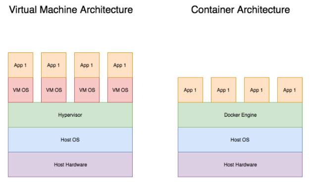

# Docker swarm essentials: Setting up, scaling, and removing your docker swarm cluster

In this interactive tutorial, you'll learn how to use docker swarm mode to create your own docker cluster. In addition to this, this tutorial will also explore how to get the docker cluster to do work for you, scaling the cluster, and lastly deleting the cluster using docker swarm.

### What is Docker

Docker is a platform with the ability to package and run an application in an isolated environment referred to as a container. The isolated environment lets users run many containers simultaneously on the same host and the container itself can run the application. This means that the applications run in the container are not affected by what is installed on the host, hence the isolated environment.

This allows users to run their applications with the same expected behavior regardless of the host. It also provides a way to test on different prerequisites as it is customizable to run on different libraries, Dependencies, and operating systems.

The outcome of this is a platform that can be used to deliver and deploy applications in a fast and consistent way.

Read more about Docker on the [Docker website](https://docs.docker.com/engine/swarm/)

### What is Docker Swarm mode

Docker swarm is a feature that allows users to natively manage a cluster of physical or virtual machines running docker. Once the group has been clustered together, the standard docker commands can still be used and will be carried out by the cluster. Docker swarm is referred to as a docker container orchestration tool. Compared to alternatives, docker swarm mode is a good alternative to get a cluster up and running in a short time due to its native implementation for docker.

Features include, but are not limited to:
- Scaling a service to several tasks of your choice
- Load balancing, meaning that every node is capable of balancing load requests across multiple containers in the cluster.

More features are listed on the [Docker website](https://docs.docker.com/engine/swarm/)

### Why does this matter?

There are several reasons why docker clusters are useful for software systems.

- <strong>High level of availability and reliability</strong>. In this age, companies can lose a large sum of revenue if their services were to go down. Having systems that can guarantee uptime even when some nodes fail are therefore crucial.

- <strong>Fast accessability</strong>. Having several nodes ready to deliver data lessens the risk of a connection getting oversaturated, leading to better connectivity

- <strong>Effective use of performance</strong>. Using the docker engine to host apps instead of having to spin up a virtual OS for each app allows for better and more efficient usage of computing power.

### Learning Objective

- Setup a basic docker cluster using docker swarm mode
- Scale your docker cluster
- Removing nodes from the cluster and the cluster itself
- How to manage docker clusters using docker swarm mode and get a foundation of docker clustering change: (to get an understanding of alternatives such as Kubernetes.)

### Table of Contents

- Creating a docker swarm cluster
- Scaling the docker swarm cluster
- Removing the docker swarm cluster
